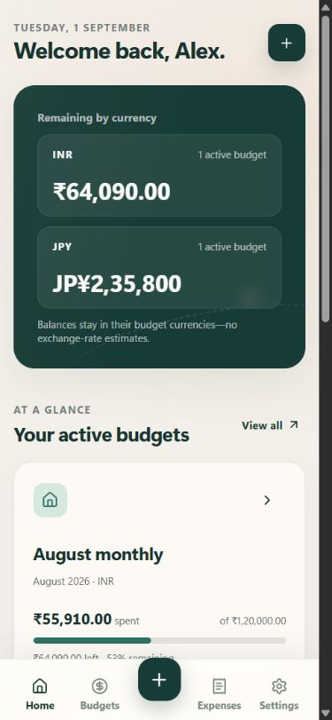
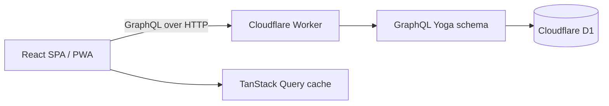

<p align="center">
  
</p>

# Pockets & Paths

[](https://github.com/patel-jay/pockets-and-paths/actions/workflows/ci.yml)
[](LICENSE)

A multi-currency budget planner for everyday life and temporary journeys.

Pockets & Paths lets one person run a recurring monthly plan alongside any number of fixed-date budgets for trips, events, relocations, or other temporary chapters. Each budget owns one currency, and every expense inside it uses that currency automatically.


<p align="center">
  
</p>

## Product highlights

- Recurring monthly and fixed-date temporary budgets can be active together.
- Budget names, totals, and dates can be edited; completed plans can be archived and restored.
- Expenses inherit their budget’s currency, keeping entry and reporting unambiguous.
- Expense dates place spending into the matching monthly period; entries can be edited, deleted,
  filtered, and paged without rewriting older months.
- Optional category limits show spent, remaining, and overspent percentages without forcing every category into an allocation.
- Expenses are never blocked by an exhausted plan; the app warns first, then records reality and shows the true overspend.
- The dashboard groups remaining and overspent balances by currency instead of presenting a misleading converted total.
- Responsive SPA navigation and an installable PWA shell work across phones and larger screens.
- A dummy login opens an isolated, cookie-backed demo profile for each browser, with logout and reset controls.
- Invite-only personal accounts keep durable data available across devices without opening public registration.
- CSV and JSON downloads make routine analysis and personal backups straightforward.

## Stack

- React 19, React Router 8, TypeScript, Vite
- TanStack Query for server-state caching
- GraphQL Yoga on a Cloudflare Worker
- Cloudflare D1 (SQLite) with prepared statements and migrations
- Recharts, Sass, Lucide icons
- Vitest, Playwright, ESLint, Prettier, GitHub Actions



## Run locally

Prerequisite: Node.js 24+.

```bash
npm ci
npm run dev
```

Open `http://127.0.0.1:4173` on the development computer. The development command applies pending D1 migrations before starting. Sign in with `demo@pocketsandpaths.app` and password `pathfinder`; the Worker seeds a realistic monthly budget plus a temporary Japan budget for each isolated browser session.

For local personal-account testing, copy `.dev.vars.example` to `.dev.vars`. The checked-in example uses Cloudflare's published Turnstile test keys; choose your own local invite code and long authentication pepper. Registration creates an empty personal profile rather than copying the demo data.

To preview the app from another device on the same trusted Wi-Fi network, open the `Network` URL printed by Vite (for example, `http://192.168.x.x:4173`). If it is unavailable, allow Node.js through the computer's firewall for private networks. The local IP address may change between connections.

Seed dates are generated relative to the current month, so a newly reset demo always opens with a current monthly plan and an upcoming temporary journey.

Useful commands:

```bash
npm run format:check
npm run typecheck
npm run lint
npm test
npx playwright install chromium
npm run test:integration
npm run test:e2e
npm run build
```

The unit suite covers currency support, parsing, spending positions, grouped currency balances, relative seed dates, and password verification. The integration suite exercises the real Worker, GraphQL endpoint, and local D1 database—including invite-only registration, account sessions, demo isolation, ownership checks, budget editing and archiving, currency inheritance, database reads, and overspending. A browser smoke test verifies the primary demo sign-in and budgeting flow.

## Data and currency model

Money is stored as integer minor units, never as floating-point values. A budget selects its currency when it is created; expenses do not accept a separate currency or exchange rate. The profile’s default currency only preselects new budget forms. On the dashboard, balances are summed only when their currency matches and are displayed as separate groups.

Overall-budget progress can exceed 100%; remaining and overspent amounts are separate, non-negative values. A category with no limit reports spending without inventing a percentage or overspending state.

## Deployment outline

The repository includes separate Cloudflare Worker configurations for a public demo and a private
personal deployment. Each needs its own D1 database; no production resources or secrets are
committed. Follow the [deployment and backup guide](docs/deployment.md) to create the databases,
apply migrations, register the owner once, close registration, and keep restorable exports.

The current release intentionally has no email verification or password-recovery workflow, so
retain the account credentials and authentication secrets safely.

See [architecture](docs/architecture.md), [product decisions](docs/product-decisions.md), and [security notes](docs/security.md) for the reasoning behind the implementation. The project is available under the [MIT License](LICENSE).

## Current scope

This is a focused personal budgeting release. Visitors can use the browser-isolated demo, while the owner can create an invite-only personal account protected by Turnstile and request throttling. Email verification, password recovery, multi-factor authentication, external identity, cross-currency expense conversion, collaborative budgets, bank imports, and a durable offline mutation queue are intentionally outside the current release. The PWA caches the application shell; GraphQL data remains network-first.
