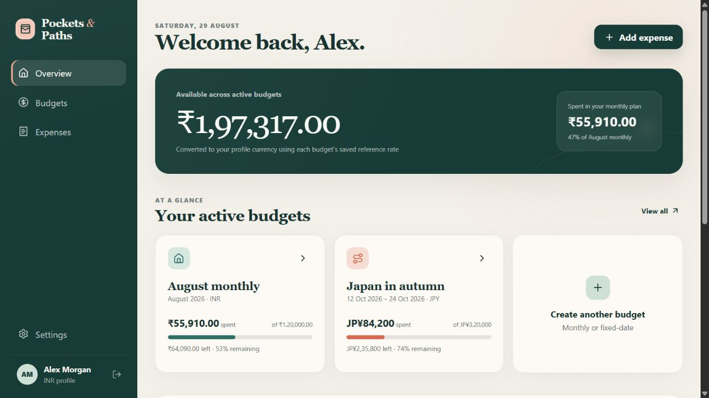
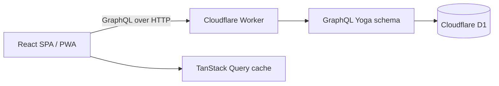

# Pockets & Paths

[](https://github.com/patel-jay/pockets-and-paths/actions/workflows/ci.yml)
[](LICENSE)

A multi-currency budget planner for everyday life and temporary journeys.

Pockets & Paths lets one person run a recurring monthly plan alongside any number of fixed-date budgets for trips, events, relocations, or other temporary chapters. Expenses keep the currency that was actually paid while each budget reports in its chosen currency.



## Product highlights

- Recurring monthly and fixed-date temporary budgets can be active together.
- Expenses have a budget, category, paid currency, date, and optional conversion rate.
- Optional category limits show spent, remaining, and overspent percentages without forcing every category into an allocation.
- Expenses are never blocked by an exhausted plan; the app warns first, then records reality and shows the true overspend.
- The profile currency provides one combined view without erasing original amounts.
- Responsive SPA navigation and an installable PWA shell work across phones and larger screens.
- A dummy login opens an isolated, cookie-backed demo profile for each browser, with logout and reset controls.

## Stack

- React 19, React Router 8, TypeScript, Vite
- TanStack Query for server-state caching
- GraphQL Yoga on a Cloudflare Worker
- Cloudflare D1 (SQLite) with prepared statements and migrations
- Recharts, Sass, Lucide icons
- Vitest, Playwright, ESLint, Prettier, GitHub Actions



## Run locally

Prerequisite: Node.js 24+.

```bash
npm ci
npm run dev
```

Open `http://127.0.0.1:4173`. The development command applies pending D1 migrations before starting. Sign in with `demo@pocketsandpaths.app` and password `pathfinder`; the Worker seeds a realistic monthly budget plus a temporary Japan budget for each isolated browser session.

Seed dates are generated relative to the current month, so a newly reset demo always opens with a current monthly plan and an upcoming temporary journey.

Useful commands:

```bash
npm run format:check
npm run typecheck
npm run lint
npm test
npx playwright install chromium
npm run test:integration
npm run test:e2e
npm run build
```

The unit suite covers money conversion, parsing, spending positions, and relative seed dates. The integration suite exercises the real Worker, GraphQL endpoint, and local D1 database—including viewer isolation, ownership checks, mutations, database reads, and overspending. A browser smoke test verifies the primary sign-in and budgeting flow.

## Data and currency model

Money is stored as integer minor units, never as floating-point values. An expense stores both its original amount and its converted amount in the selected budget’s reporting currency. Conversion uses integer micro-rates and deterministic rounding. Overall-budget progress can exceed 100%; remaining and overspent amounts are separate, non-negative values. A category with no limit reports spending without inventing a percentage or overspending state.

The exchange rates included in this portfolio demo are fixed reference values, not live financial data and not suitable for financial decisions. The boundary is isolated in `worker/money.ts`, so a production-grade rate provider can replace it without changing the budget model.

## Deployment outline

The repository is configured for a Cloudflare Worker with D1, but no production resources are committed or created.

1. Create a D1 database.
2. Replace the placeholder `database_id` in `wrangler.jsonc`.
3. Apply the checked-in migrations to the target database.
4. Build and deploy the Worker through Cloudflare.

See [architecture](docs/architecture.md), [product decisions](docs/product-decisions.md), and [security notes](docs/security.md) for the reasoning behind the implementation. The project is available under the [MIT License](LICENSE).

## Current scope

This is a focused portfolio MVP. The visible dummy login is a browser-isolated preview flow, not production authentication. External identity, live exchange-rate ingestion, collaborative budgets, bank imports, and a durable offline mutation queue are intentionally outside the current release. The PWA caches the application shell; GraphQL data remains network-first.
